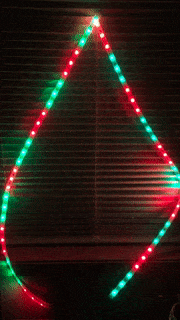

# arduino-ledstrip-fastled

## GitHub repository: https://github.com/r-craig73/arduino-ledstrip-fastled

#### By Ron Craig (https://github.com/r-craig73 * ron.craig@comcast.net)

## Description
### Personal project: A sketch and library file using two LED strips, an Arduino UNO, and FastLED library. The goal is to simulate Christmas lights using a tree outline!

<table>
    <thead>
        <tr>
            <th>Light Show</th>
            <th>Loop Steps</th>
        </tr>
    </thead>
    <tbody>
        <tr>
            <td rowspan=5><kbd></kbd></td>
            <td>1. Alternate green-red lights.</td>
        </tr>
        <tr>
            <td>2. A trail removing the green-red lights, one strip at a time.</td>
        </tr>
        <tr>
            <td>3. All red lights. </td>
        </tr>
        <tr>
            <td>4. All green lights.</td>
        </tr>
        <tr>
            <td>5. Back to step 1.</td>
        </tr>
    </tbody>
</table>

## Hardware Items
1. Arduino UNO.
2. Two (2) 1 meter Tricolor LED strip (each strip contains ten (10) TM1803 IC chips).
3. 12 VDC, 100mA power supply.
4. Circuit breadboard.
5. Several jumper wires.

## Instructions (assuming Mac OS X)
1. Download the entire project or copy file `lib/xmastree-2LED-strips.ino`
2. Install Arduino IDE software on your computer https://www.arduino.cc/en/Main/Software.
3. Connect USB cable between the Arduino UNO and computer and verify connection (Tools->Port-> /dev/cu.usbmodem000000).
4. Load FastLed library to UNO (Sketch->Include Library->Manage Libraries, search `FastLed`, Install latest version).
5. Connect LED strips, jumper wires, and power supply using the following schematic below (schematic diagram coming soon).
6. Open (File->Open) library file `xmastree-2LED-strips.ino`.
7. Verify and load library file.
8. Watch the Christmas light magic!

## Technologies Used
`Arduino, FastLED library, C++`

## Support and contact details
_Please contact ron.craig@comcast.net with any questions._

### MIT License